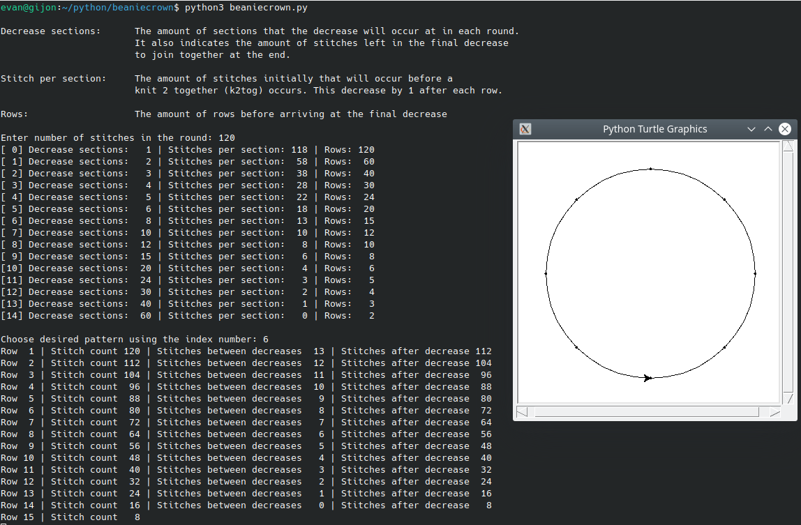

# Readme

This program is written with the intent to help with the calculation of the crown decreases on a beanie knitted on circular needles. The program inputs a total stitch count in the round, determines the available decrease methods, and after one is chosen by the user, produces a table of stiches per row and an illustration.

On Ubuntu, **tkinter** is required for drawing


```bash 
apt install python3-tk
```


## Example

With 120 stitches in the round, decreasing in 15 rows:




## Credit

This code was guided by the advice given on:

https://fortheknitofit.wordpress.com/2013/07/11/knitting-101-hats-decreasing-the-crown/